<div align="center">


# 🏋️ GymNest

### Fitness & Gym Management Platform

**GymNest** is a full-stack fitness and gym management web application where members can discover and book fitness classes, trainers can manage their schedule and community posts, and administrators have full control over the platform — users, classes, applications, payments, and content moderation.

<br />

[](https://gymnest-client-k88v.vercel.app/)
[](https://github.com/kouser-ahamed/gymnest-client)
[](https://github.com/kouser-ahamed/gymnest-server)

</div>

---

## 📋 Table of Contents

- [Project Overview](#-project-overview)
- [Live Links](#-live-links)
- [Admin Credentials](#-admin-credentials)
- [Key Features](#-key-features)
- [How the System Works](#-how-the-system-works)
- [Page Structure](#-page-structure)
- [Dashboard Guide](#-dashboard-guide)
- [Authentication System](#-authentication-system)
- [Payment Integration](#-payment-integration)
- [Challenge Requirements](#-challenge-requirements)
- [Technology Stack](#-technology-stack)
- [NPM Packages](#-npm-packages)
- [Environment Variables](#-environment-variables)
- [Installation & Setup](#-installation--setup)
- [Project Routes](#-project-routes)
- [API Overview](#-api-overview)
- [Soft Block Functionality](#-soft-block-functionality)
- [Screenshots](#-screenshots)
- [Developer](#-developer)

---

## 📌 Project Overview

GymNest is a comprehensive fitness and gym management platform designed for **fitness enthusiasts**, **gym trainers**, and **administrators**. The platform provides a complete workflow for:

- Discovering and booking fitness classes
- Managing trainer-created classes and student enrollment
- Community forum discussions with likes, comments, and replies
- Stripe-powered payment processing
- Role-based dashboard access for Members, Trainers, and Admins
- Soft-block user restriction system
- Admin-level moderation of users, classes, and forum content

The platform is built using the **MERN Stack** (MongoDB, Express.js, React/Next.js, Node.js) with **Better Auth** for authentication, **JWT HTTPOnly cookies** for secure sessions, and **Stripe** for payment processing.

---

## 🌐 Live Links

| Item | Link |
|------|------|
| 🌐 Live Website | https://gymnest-client-k88v.vercel.app/ |
| 📁 Client Repository | https://github.com/kouser-ahamed/gymnest-client |
| 🖥️ Server Repository | https://github.com/kouser-ahamed/gymnest-server |

---

## 🔐 Admin Credentials

```
Email    :  kouserahamed@admin.com
Password :  GymnestAdmin@X
```

> To test the full member and trainer flow, register a new account at `/auth/signup`. From the admin dashboard you can then approve the trainer application and explore the complete role lifecycle.

---

## ✨ Key Features

### 🌍 Public Features
- Professional landing page with animated banner, featured classes, and latest forum posts
- Browse all approved fitness classes with search and filter
- Search classes by **class name** using MongoDB `$regex`
- Filter classes by **category** (Yoga, Cardio, HIIT, Strength, Weights, Zumba)
- Server-side **pagination** on All Classes page and Community Forum
- Community Forum visible to public users (post preview only)
- Responsive Navbar with conditional dashboard link based on user role
- Footer with logo, quick links, social media links (X), copyright, and contact info
- Custom loading states and custom 404 error page
- Dark/Light mode friendly UI

### 👤 Member Features
- Member dashboard overview: total booked classes and total favorites with profile card
- Browse approved classes and view full class details
- Book classes through **Stripe Checkout** (duplicate booking prevented)
- Add classes to favorites (duplicate favorites prevented)
- Remove favorite classes from dashboard
- Apply to become a trainer (experience, specialty form)
- View trainer application status (Pending / Approved / Rejected)
- See admin feedback on rejection or demotion
- Read full forum posts (login required)
- Like and dislike forum posts (once per user)
- Add comments and replies to forum posts
- Edit or delete own comments

### 🏋️ Trainer Features
- Trainer dashboard overview: total classes created and total enrolled students
- Add new fitness classes (status defaults to **Pending** until admin approval)
- View, update, and delete own classes
- View modal of students enrolled in each specific class
- Publish posts to the Community Forum
- View and delete own forum posts with confirmation

### 🛡️ Admin Features
- Admin dashboard overview: total users, total classes, total bookings
- Recharts analytics charts on dashboard
- Manage all users: Block, Unblock, Promote to Admin
- Soft-block enforcement: blocked users can browse but cannot perform state-changing actions
- Review pending trainer applications with full applicant details in a modal
- Approve or Reject trainer applications with written feedback
- Demote active trainers back to Member role with confirmation
- Approve, Reject, or Delete trainer-submitted classes
- Add Admin forum posts
- View all Stripe payment transaction history (email, amount, date, transaction ID)
- Moderate and delete inappropriate community forum posts

### 🎁 Optional / Bonus Features
- ☀️ Dark / Light theme toggle
- 📊 Admin analytics using **Recharts**
- 🔔 In-app notification for trainer application status updates

---

## ⚙️ How the System Works

### Member Flow
```
Register as User
      ↓
Browse & Search Fitness Classes
      ↓
Apply to Become a Trainer (optional)
      ↓
Read Forum Posts (login required for full access)
      ↓
Book Classes via Stripe Checkout
```

### Trainer Flow
```
Apply as Trainer → Admin Approves
      ↓
Create Fitness Classes (status: Pending)
      ↓
Admin Approves Class → Visible on Public Page
      ↓
Manage Classes, View Enrolled Students
      ↓
Post to Community Forum
```

### Admin Flow
```
Manage Users (Block / Unblock / Promote)
      ↓
Review Trainer Applications (Approve / Reject + Feedback)
      ↓
Manage Classes (Approve / Reject / Delete)
      ↓
View Transactions & Moderate Forum
```

---

## 🗂️ Page Structure

### Public Routes

| Page | URL | Description |
|------|-----|-------------|
| Home | `/` | Banner, featured classes, latest forum posts, extra sections |
| All Classes | `/all-classes` | Approved classes with search, filter, pagination |
| Community Forum | `/community-forum` | Forum post previews with pagination |
| Login | `/auth/signin` | Email/password + Google login |
| Register | `/auth/signup` | User registration form |

### Protected Routes (Login Required)

| Page | URL | Description |
|------|-----|-------------|
| Class Details | `/all-classes/[id]` | Full class info, Book Now, Add to Favorites |
| Payment Page | `/all-classes/[id]/booking` | Stripe Checkout |
| Forum Post Details | `/community-forum/[id]` | Full post, likes, comments |
| Member Dashboard | `/dashboard/member` | Overview, booked classes, favorites, apply trainer |
| Trainer Dashboard | `/dashboard/trainer` | Overview, add class, my classes, forum posts |
| Admin Dashboard | `/dashboard/admin` | Full platform management |

---

## 📊 Dashboard Guide

### 👤 Member Dashboard

| Page | Description |
|------|-------------|
| Overview | Stats cards (booked classes, favorites), profile info, role badge, trainer application status with feedback |
| Booked Classes | Table of all booked classes with Class Name, Trainer, Schedule, and View Details |
| Apply as Trainer | Form with Experience (years) and Specialty — status becomes Pending on submit |
| Favorite Classes | Grid of saved classes with Remove button |

### 🏋️ Trainer Dashboard

| Page | Description |
|------|-------------|
| Overview | Total classes created, total enrolled students, profile card with Trainer badge |
| Add Class | Form: Class Name, Image, Category, Difficulty, Duration, Schedule, Price, Description |
| My Classes | Table of own classes with Update, Delete, and View Students (modal) buttons |
| Add Forum Post | Title, Image (Imgbb upload), Description |
| My Forum Posts | Grid of own posts with Delete + confirmation |

### 🛡️ Admin Dashboard

| Page | Description |
|------|-------------|
| Overview | Platform stats with Recharts charts, Admin profile card |
| Manage Users | Table: Name, Email, Role, Status — Block/Unblock, Make Admin actions |
| Applied Trainers | Pending applications table — Details modal with Experience, Specialty, Feedback input, Approve/Reject |
| Manage Trainers | Active trainers table — Demote to User with confirmation |
| Manage Classes | All classes table — Status shown, Approve/Reject/Delete buttons |
| Add Forum Post | Title, Image (Imgbb upload), Description |
| Transactions | Read-only table: User Email, Amount, Date, Transaction ID |
| Forum Management | All forum posts — Admin Delete for moderation |

---

## 🔑 Authentication System

GymNest uses **Better Auth** for authentication with **JWT stored in HTTPOnly cookies** for secure session management.

### Login
- Fields: Email, Password
- Supports: Credential login and **Google OAuth**
- After login: Redirects to intended route, otherwise to Home page

### Registration
- Fields: Name, Email, Profile Image, Password
- All new users register as **Member** by default
- Password rules:
  - Minimum **6 characters**
  - At least **one uppercase** letter
  - At least **one lowercase** letter

### Session Security
```
Login → JWT Generated → Stored in HTTPOnly Cookie
            ↓
Private route accessed → Token verified by backend middleware
            ↓
Role checked → User routed to correct dashboard
            ↓
Role change by Admin → Fetched fresh from DB on next request
```

- Logged-in users **do not get redirected to login on page reload**
- Private route redirects carry a `?redirect=` parameter for post-login navigation
- Role changes (promote, demote, block) take effect immediately after refresh

---

## 💳 Payment Integration

GymNest uses **Stripe Checkout** for class booking payments.

```
User clicks "Book Now" on Class Details page
            ↓
System checks for duplicate booking (backend validated)
            ↓
User redirected to Payment Page
            ↓
Stripe Checkout displays: Class Name, Trainer Name, Price
            ↓
Successful payment → Booking saved to MongoDB
            ↓
User redirected to Dashboard or Success page
```

- Admin can view all transactions in the **Transactions** dashboard page
- Members can view their booked classes from the **Booked Classes** dashboard page

---

## 🚀 Challenge Requirements

| Requirement | Implementation |
|-------------|---------------|
| Search by Class Name | MongoDB `$regex` on class name field |
| Filter by Category | MongoDB `$in` on category field |
| JWT Authentication | Generated on login, stored in HTTPOnly cookie |
| Token Middleware | Verifies JWT on all protected dashboard APIs |
| Role Protection | Separate middleware for User / Trainer / Admin routes |
| Server-side Pagination | Implemented on All Classes and Community Forum pages |

---

## 🛠️ Technology Stack

### Frontend

| Package | Purpose |
|---------|---------|
| `next` | React framework with SSR and file-based routing |
| `react` / `react-dom` | UI component library |
| `tailwindcss` | Utility-first CSS styling |
| `@heroui/react` | Component library (cards, modals, tables, badges) |
| `@gravity-ui/icons` | Icon system |
| `better-auth` | Authentication client |
| `framer-motion` | Homepage animations and transitions |
| `recharts` | Admin dashboard analytics charts |
| `react-toastify` | Toast notifications (success, error, restricted) |
| `@stripe/stripe-js` | Stripe payment UI integration |

### Backend

| Package | Purpose |
|---------|---------|
| `express` | REST API web framework |
| `mongodb` | NoSQL database driver |
| `cors` | Cross-origin resource sharing |
| `dotenv` | Environment variable management |
| `stripe` | Stripe payment processing |
| `better-auth` | Authentication server library |
| `jose-cjs` | JWT creation and verification middleware |

---

## 📦 NPM Packages

### Client Side

```
next
react
react-dom
tailwindcss
@heroui/react
@gravity-ui/icons
better-auth
framer-motion
recharts
react-toastify
@stripe/stripe-js
```

### Server Side

```
express
mongodb
cors
dotenv
stripe
better-auth
jose-cjs
```

---

## 🔒 Environment Variables

### Client — create `.env.local`

```env
NEXT_PUBLIC_BASE_URL=your_server_api_url
NEXT_PUBLIC_STRIPE_PUBLISHABLE_KEY=your_stripe_publishable_key
NEXT_PUBLIC_IMGBB_API_KEY=your_imgbb_api_key
```

### Server — create `.env`

```env
PORT=5000
MONGODB_URI=your_mongodb_connection_string
CLIENT_URL=your_client_live_url
STRIPE_SECRET_KEY=your_stripe_secret_key
BETTER_AUTH_SECRET=your_better_auth_secret
BETTER_AUTH_URL=your_server_url
```

> ⚠️ All sensitive credentials (MongoDB URI, Stripe keys, auth secrets) are stored only in environment variables and are never committed to the repository.

---

## 💻 Installation & Setup

### Prerequisites

- Node.js v18+
- MongoDB Atlas account or local MongoDB
- Stripe account
- ImgBB API key
- Google OAuth credentials

### Run Client Locally

```bash
git clone https://github.com/kouser-ahamed/gymnest-client.git
cd gymnest-client
npm install
# Create .env.local with required variables
npm run dev
```

### Run Server Locally

```bash
git clone https://github.com/kouser-ahamed/gymnest-server.git
cd gymnest-server
npm install
# Create .env with required variables
npm run dev
```

---

## 🗺️ Project Routes

### Public Routes

```
/
/all-classes
/community-forum
/auth/signin
/auth/signup
```

### Protected Routes

```
/all-classes/[id]
/all-classes/[id]/booking
/community-forum/[id]

/dashboard/member
/dashboard/member/booked-classes
/dashboard/member/apply-trainer
/dashboard/member/favorite-classes

/dashboard/trainer
/dashboard/trainer/add-class
/dashboard/trainer/my-classes
/dashboard/trainer/add-forum
/dashboard/trainer/my-posts

/dashboard/admin
/dashboard/admin/users
/dashboard/admin/applied-trainers
/dashboard/admin/trainers
/dashboard/admin/classes
/dashboard/admin/add-forum
/dashboard/admin/transactions
/dashboard/admin/forum-management
/dashboard/admin/settings
```

---

## 🔌 API Overview

### Auth & Users
- Get current logged-in user
- Update user role and status
- Block / Unblock users
- Promote user to Admin

### Classes
- Create class (Trainer)
- Get approved classes with search, filter, pagination (Public)
- Get class details (Authenticated)
- Approve / Reject / Delete class (Admin)
- Update class (Trainer)
- Get class students (Trainer)

### Bookings & Payments
- Create Stripe payment intent
- Save booking on successful payment
- Get member booked classes
- Get all transactions (Admin)
- Duplicate booking prevention

### Favorites
- Add to favorites
- Remove from favorites
- Get favorite classes
- Duplicate favorite prevention

### Trainer Applications
- Submit application (Member)
- Get all pending applications (Admin)
- Approve application (Admin)
- Reject with feedback (Admin)
- Demote trainer to Member (Admin)

### Community Forum
- Get public forum posts with pagination
- Get full post details (Authenticated)
- Create forum post (Trainer / Admin)
- Delete own forum post
- Like / Dislike post (once per user)
- Add comment and reply
- Edit / Delete own comment
- Admin delete any post (moderation)

---

## 🔇 Soft Block Functionality

When an admin blocks a user, that user can still:
- ✅ Log in to the platform
- ✅ Browse classes and forum posts
- ✅ Access the dashboard

But a blocked user **cannot**:
- ❌ Book a class
- ❌ Add or remove favorite classes
- ❌ Apply to become a trainer
- ❌ Like or dislike forum posts
- ❌ Write comments or replies
- ❌ Edit or delete their own comments

When a blocked user attempts a restricted action, the UI shows:

```
You are restricted by admin.
```

The **backend also validates** user block status on every state-changing API call — frontend restrictions alone cannot be bypassed.

---

## 📸 Screenshots

| Preview |
| Image |
|--------|
| 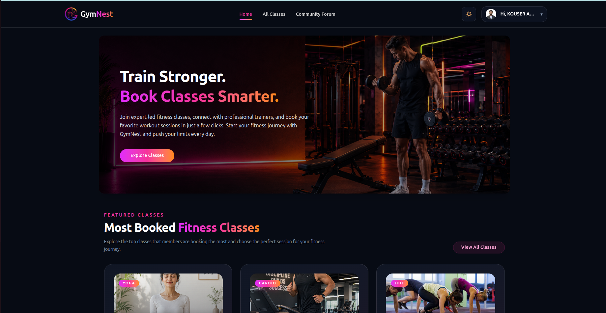 |
| 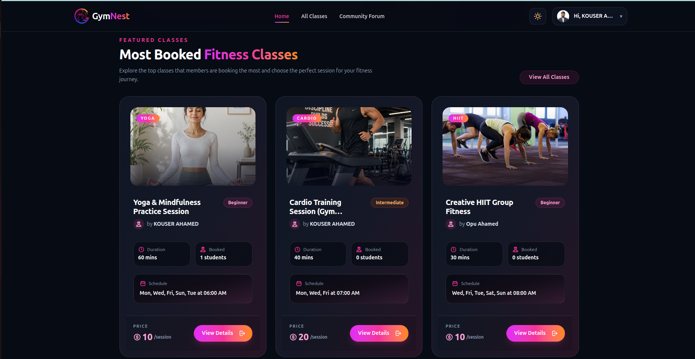 |
| 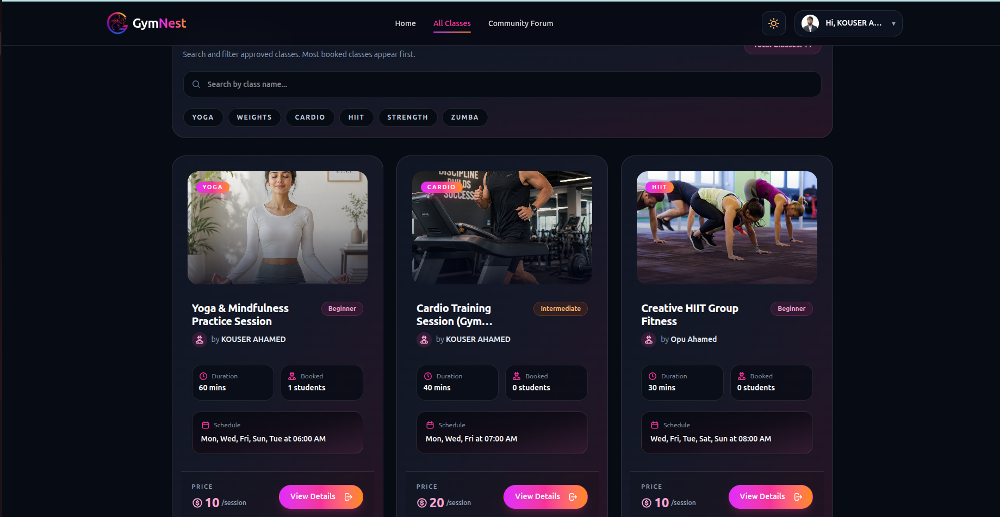 |
| 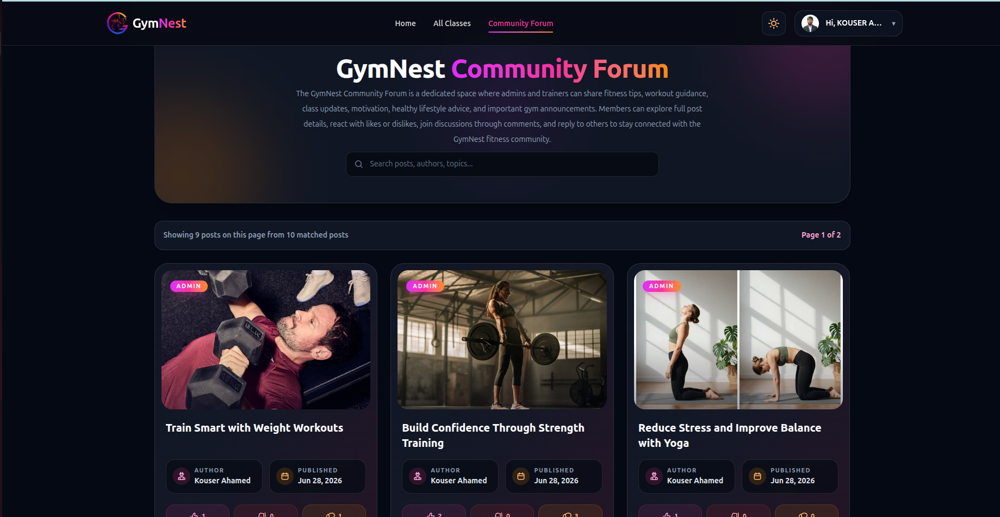 |
| 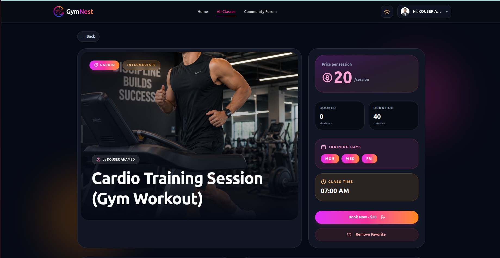 |
| 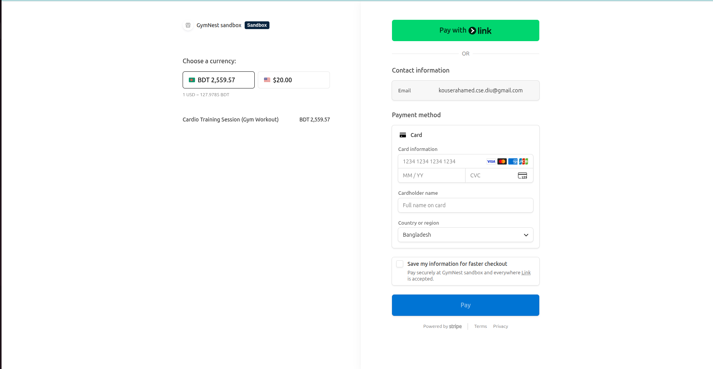 |
| 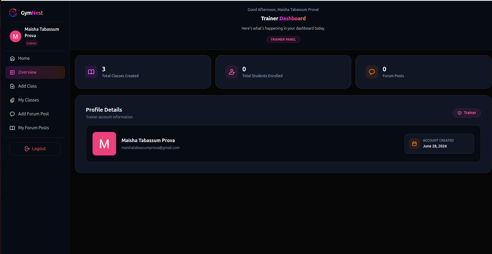 |
| 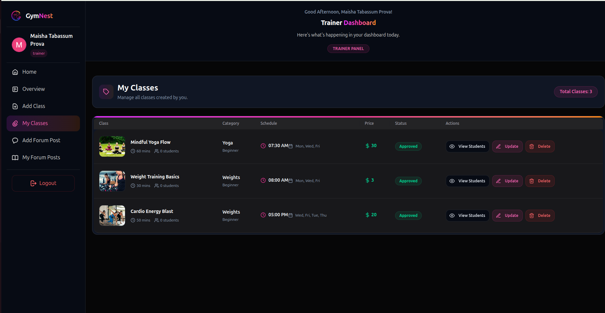 |
| 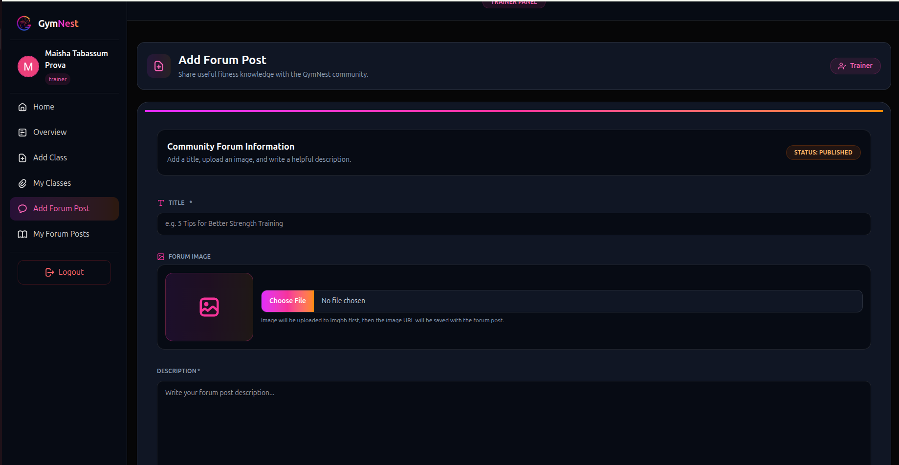 |
| 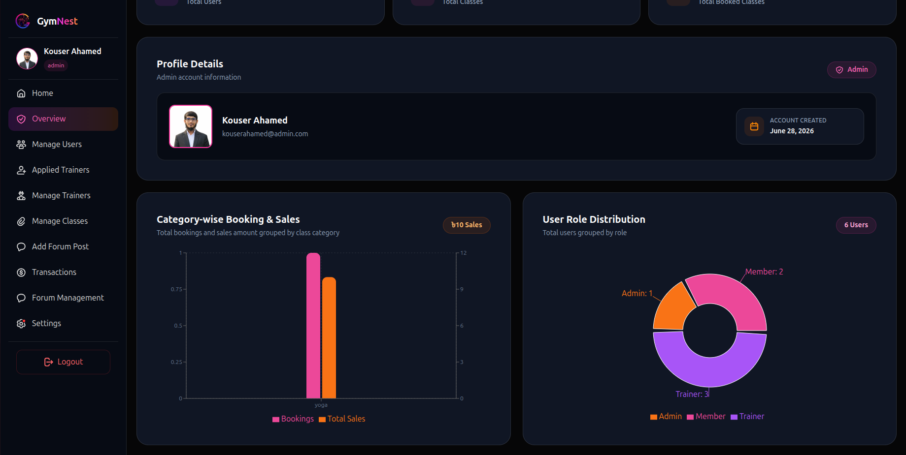 |
| 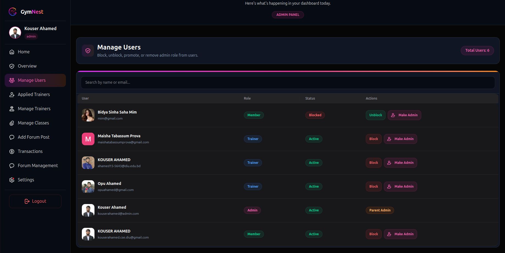 |
| 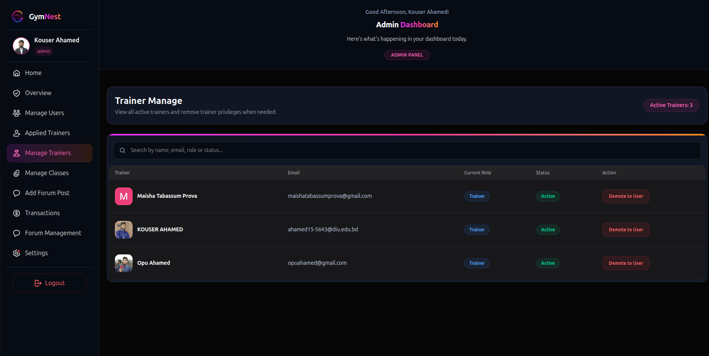 |
| 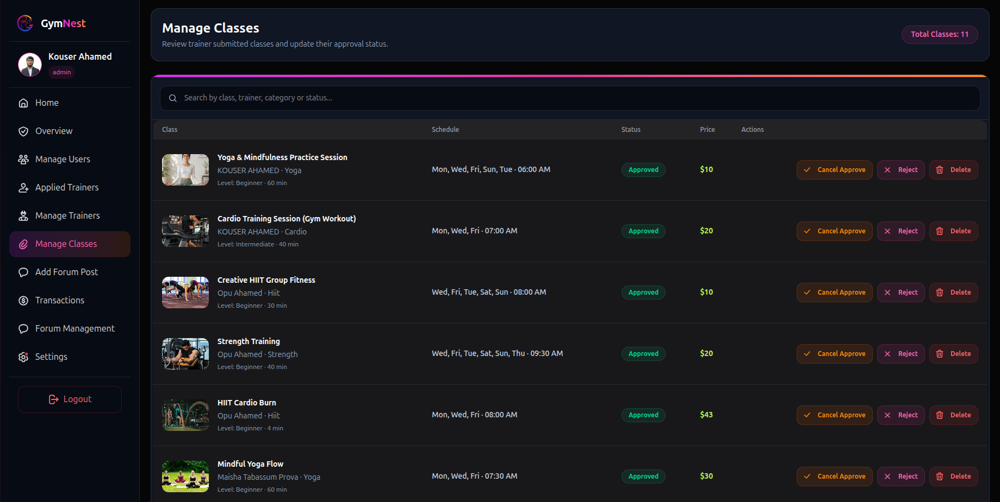 |
| 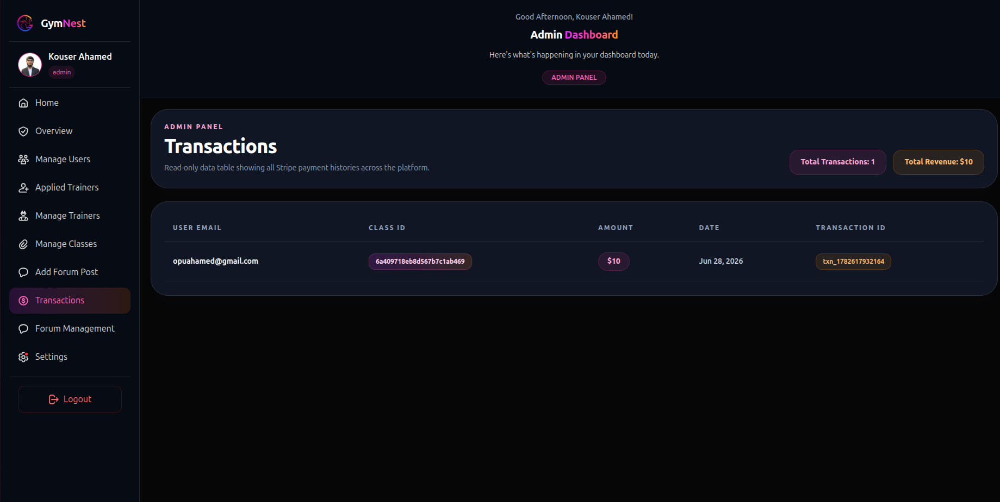 |
| 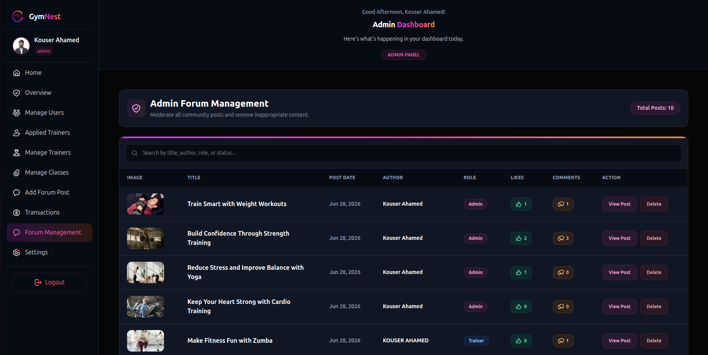 |
| 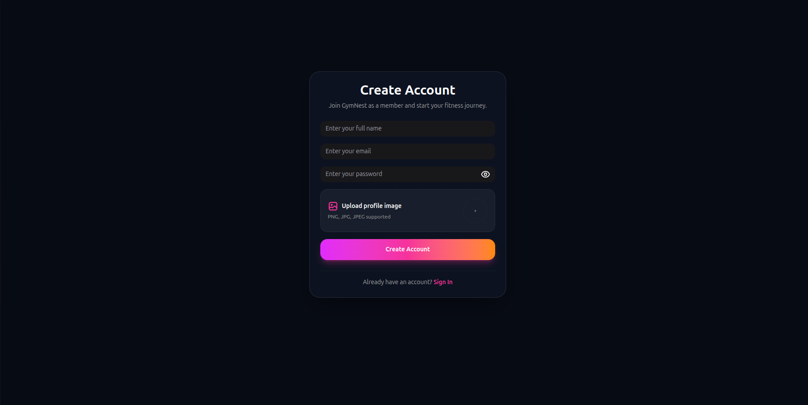 |
| 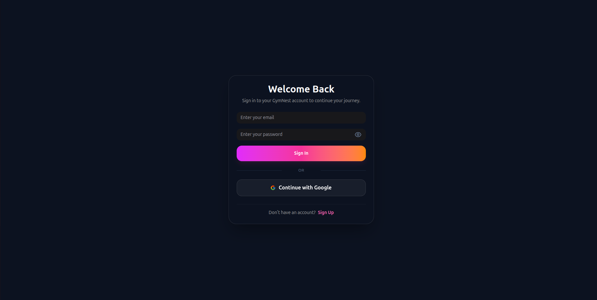 |

---

## 👨‍💻 Developer

**Kouser Ahamed**

A full-stack web development capstone project built with **JavaScript**, **React.js**, **Next.js**, **Node.js**, **Express.js**, **MongoDB**, **Better Auth**, **JWT**, **Stripe**, **Tailwind CSS**, and **HeroUI**. The platform demonstrates real-world **Role-Based Access Control (RBAC)** for **User**, **Trainer**, and **Admin**, secure authentication and authorization, **Stripe** payment integration, **RESTful API** development, dynamic dashboard management, and a modern, responsive UI designed for production-ready web applications.

---

## 📝 Project Information: 

```
Project Name  :  GymNest — Fitness & Gym Management Platform
Admin Email   :  kouserahamed@admin.com
Admin Password:  GymnestAdmin@X
Live Site     :  https://gymnest-client-k88v.vercel.app/
Client Repo   :  https://github.com/kouser-ahamed/gymnest-client
Server Repo   :  https://github.com/kouser-ahamed/gymnest-server
```

---

<div align="center">

© 2026 GymNest. All rights reserved.

</div>
